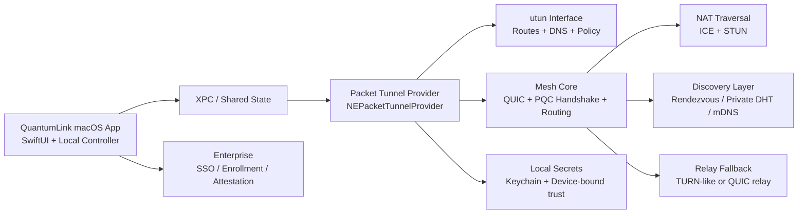

# QuantumLink macOS Product Specification

## Executive summary

QuantumLink should be specified as a **peer-to-peer mesh VPN with a server-minimized control plane**, not as a literally server-free system. On the public internet, a practical mesh needs at least bootstrap and rendezvous assistance, and in a nontrivial share of cases it also needs a relay path when direct UDP connectivity fails. That follows directly from the way ICE, STUN, and TURN are standardized: STUN is only a tool, ICE is the coordination framework, and TURN exists precisely because many peers cannot connect directly through NATs and firewalls. A defensible product definition is therefore: **no mandatory centralized VPN concentrator for the steady-state data plane, but optional stateless helper services for discovery, hole punching, and relay fallback**. citeturn25search3turn12search0turn10search7turn34search2

For macOS, the correct architectural center of gravity is the entity["company","Apple","cupertino tech company"] **Network Extension** stack in user space, specifically a packet tunnel provider attached to a `utun` interface. Apple’s current guidance is to move VPN products away from packet filter tricks and away from legacy kernel extension patterns; Apple explicitly says packet filter is not API, and its packet tunnel provider documentation describes a virtual network interface exposed through the provider. A QuantumLink v1 should therefore be an **L3 user-space overlay** implemented with `NEPacketTunnelProvider`, not a kernel module and not a pf-based kill-switch product. citeturn5search0turn38search0turn38search1turn38search4

On post-quantum security, the repository baseline is **ML-KEM-768 session establishment, crypto agility everywhere, and cautious use of PQ signatures**. The current `qlink-core` implementation supports FIPS 203, 204, and 205 suite identifiers, uses ML-KEM-768 for session establishment, defaults device credentials to ML-DSA-65, and implements SLH-DSA-SHA2-128S for the FIPS 205 suite path. The current handshake intentionally has no X25519 or other classical key-exchange fallback. For signatures, ML-DSA-65 is the practical default leaf/device credential choice; SLH-DSA remains heavier and is best reserved for high-assurance or specialized signing flows until product requirements justify routine use.

Operationally, the product should ship as a **Developer ID–signed, notarized direct-distribution Mac app plus extension**, with PKG support for enterprise rollout and Sparkle-based background updates for non-App-Store users. Enterprise features should rely on Apple deployment primitives rather than bespoke installers: Automated Device Enrollment, Device Enrollment, Managed Device Attestation, the Extensible SSO payload, and the per-app VPN mapping payload on managed Macs. citeturn37search7turn37search10turn9view0turn9view1turn41search0turn41search1turn41search6turn41search13turn3search12turn8view1

## Product goals and target users

QuantumLink’s product goal should be **secure overlay connectivity without a hub-and-spoke trust bottleneck**. The value proposition is not “VPN, but decentralized” in the abstract. It is: **direct device-to-device encrypted reachability, low operational overhead, strong endpoint identity, minimal persistent metadata, and acceptable behavior on hostile consumer networks**. If the specification pursues those goals, QuantumLink becomes useful both as a remote-access tool and as a private connectivity substrate for device fleets, developer machines, and small-site networking.

The highest-value target users are three groups. The first is **small teams and technical individuals** who want private access between laptops, home labs, NAS devices, and personal servers without operating a gateway concentrator. The second is **security-conscious SMB and mid-market IT** that want mesh connectivity, device-bound policy, and enterprise sign-in without deploying a full SD-WAN stack. The third is **managed enterprise environments** that want per-app VPN, SSO, enrollment, device attestation, and compliance controls on macOS endpoints. Enterprise use is especially important on this platform because macOS exposes first-party deployment primitives for automated enrollment, SSO payloads, per-app VPN mapping, and managed attestation. citeturn41search0turn41search6turn41search13turn41search1turn3search12

The right use cases follow from that target set. QuantumLink should handle remote development access to private RFC1918 space, service-to-service overlay paths between edge devices, private reachability across home and office networks, and point-to-point admin access where exposing inbound ports is undesirable. It should not try to be everything in v1. In particular, a first macOS release should **not** chase full Ethernet bridging semantics, consumer-grade anonymous browsing, or full-scale enterprise ZTNA policy orchestration. The first release should be an **IP-layer mesh overlay with strong identity, usable UX, and predictable recovery behavior**.

A hard product boundary is also necessary: a “serverless mesh VPN” for the open internet is only credible if “serverless” means **no mandatory centralized traffic concentrator**. If marketing or internal design assumes discovery and relay can be eliminated entirely, the product will fail under symmetric NAT, UDP-blocking firewalls, captive networks, and sleeping/mobile peers. TURN exists because those conditions are normal, not edge cases. citeturn25search3turn12search0turn10search7

## Threat model and security requirements

QuantumLink should assume six attacker classes. First, a **passive network observer** such as an ISP, Wi‑Fi operator, relay operator, or compromised LAN element. Second, an **active on-path attacker** who can reorder, replay, drop, or inject packets during discovery or transport. Third, a **malicious or compromised bootstrap/rendezvous service** that can lie about peer locations or attempt correlation. Fourth, a **malicious relay** that can observe metadata and packet timing but should not learn payload contents. Fifth, a **stolen or malware-compromised endpoint**. Sixth, a **curious local network** where discovery traffic itself leaks hostnames or service presence. RFC 6762 and related privacy analysis make the local-LAN point explicit: mDNS materially exposes device presence and naming information and should not be a silent always-on discovery mode. citeturn36search0turn35search1

The minimum cryptographic requirement for confidentiality in this repository is **post-quantum ML-KEM-768 session establishment** with transcript-bound HKDF key derivation and strict suite negotiation. The current suite identifiers are `QLINK-FIPS203-MLKEM768-HKDFSHA256-v1`, `QLINK-FIPS204-MLDSA65-HKDFSHA256-v1`, and `QLINK-FIPS205-SLHDSA-SHA2-128S-HKDFSHA256-v1`. The Rust core rejects the legacy `QLINK-HYBRID-X25519-MLKEM768-HKDFSHA256-v1` identifier so documentation and tests do not imply a classical fallback that is not implemented.

The minimum authentication requirement is **versioned device credentials plus explicit crypto agility**. For leaf credentials, **ML-DSA-65** is the practical post-quantum choice: it lands in NIST security category 3 and has a 1952-byte public key and a 3309-byte signature. **SLH-DSA** is too heavy for routine live peer authentication in a mesh: even its 128-bit security parameter sets have 7856-byte or 17088-byte signatures, and the larger sets become much bigger still. The specification should therefore use **ML-DSA-65 for leaf/device credentials**, and reserve **SLH-DSA** for offline roots, recovery packages, or rare high-assurance signing flows. Because mixed classical/post-quantum credential norms are still evolving, any migration envelope should remain optional rather than a protocol invariant. citeturn16view2turn22view0turn18view0turn20view0turn20view1turn14search12

The key-management requirement is **device-local secret protection with minimal trust in the UI app**. Apple’s security model gives two useful platform primitives: the Keychain, which stores small secrets in an encrypted database, and the Secure Enclave, which provides isolated hardware-backed security services. Apple’s platform security documentation also states that keychain metadata and secret values are separately protected, and that the secret key path always involves the Secure Enclave on supported systems. The right design pattern is therefore: store QuantumLink’s long-term secret seeds and session cache material in the **Data Protection keychain**, and optionally bind sensitive operations to a **Secure-Enclave-backed local platform key** for device trust, unlock gating, and enterprise attestation workflows. That is better than assuming arbitrary PQC private keys can live natively inside the enclave API surface. citeturn27search4turn27search0turn27search2

Forward secrecy, replay protection, and metadata protection should be specified explicitly rather than left to library defaults. Every production connection should install negotiated ML-KEM-derived session keys into packet-frame encryption, with mandatory rekeying on both a time threshold and a byte-count threshold. Data packets should carry **monotonic packet numbers**, a **sliding replay window**, and per-direction key separation. Handshake messages should be transcript-bound and include anti-downgrade markers. Metadata protection should include rotating peer aliases, encrypted control-plane messages, and a strict ban on shipping usernames, hostnames, or stable organizational identifiers in cleartext discovery paths. DNS should default to tunnel-provided resolvers, not ambient local resolvers, and local-LAN discovery should be opt-in because mDNS is link-visible by design. QUIC’s packet protection, path migration, and low-latency setup make it an especially strong substrate for this model.

The table below summarizes the main post-quantum choices that matter for a mesh VPN, based on NIST FIPS 203, 204, and 205. citeturn21view0turn22view0turn20view0

| Primitive | Recommended role in QuantumLink | Security category | Notable size facts | Main trade-off |
|---|---|---:|---|---|
| ML-KEM-768 | **Default session KEM** | 3 | 1184-byte encapsulation key, 1088-byte ciphertext | Strong default; current repo has no classical ECDH fallback |
| ML-KEM-512 | Compatibility / lower-cost option | 1 | Smaller than 768 | Lower margin; not the best default |
| ML-KEM-1024 | High-assurance policy tier | 5 | 1568-byte encapsulation key, 1568-byte ciphertext | Higher cost and larger messages |
| ML-DSA-65 | **Default PQ leaf credential signature** | 3 | 1952-byte pubkey, 3309-byte signature | Practical for peer auth; still much larger than Ed25519 |
| ML-DSA-87 | High-assurance admin/root policy | 5 | 2592-byte pubkey, 4627-byte signature | Larger signatures and CPU cost |
| SLH-DSA-128s / 128f | Offline recovery / root-signing option | 1 | 7856-byte or 17088-byte signature | Conservative hash-based design, but too large for routine live handshakes |

## Privacy and compliance

For privacy, QuantumLink should be designed as if **control-plane metadata is regulated data**. Under GDPR, the core design implications come from the principles in Article 5, the privacy-by-design/default requirement in Article 25, and the security-of-processing requirement in Article 32. Those provisions require lawful and transparent processing, minimization, purpose limitation, default restriction to only necessary personal data, and appropriate technical and organizational security measures including encryption and pseudonymization where appropriate. Because VPN control planes routinely process IP addresses, device identifiers, account identifiers, connection timestamps, and potentially DNS-derived metadata, the product should treat all of that as regulated personal data in the ordinary case. citeturn32search0turn33search0turn32search7

That translates into concrete product rules. Telemetry should be **off by default unless strictly needed for service delivery or admin policy**. Relay servers should store **only short-lived operational data** needed to route traffic, defend against abuse, or support billing if billing exists later. Discovery records should use pseudonymous node identifiers and short TTLs. Debug logs should remain local unless the user or enterprise admin explicitly exports them. Support bundles should redact peer IPs by default and require an elevated export action for raw packets or raw resolver failures. In GDPR terms, that is not optional polish; it is exactly what privacy by design and data minimization demand. citeturn33search0turn32search7

The CCPA/CPRA implications are similar. The official California text requires notice at or before collection, collection/use/retention that is reasonably necessary and proportionate, contractual restrictions with service providers and contractors, and reasonable security procedures appropriate to the nature of the data. It also defines business purposes that include security/integrity and debugging, but those uses still have to remain proportionate. For QuantumLink, that means a public privacy notice must explain what identity, device, connection, and diagnostics data are collected; retention defaults must be short; and relay/update/analytics subprocessors must be under clear contractual controls if the product ever uses them. citeturn30search0turn29view1turn29view2

Export controls cannot be ignored. The U.S. BIS guidance states that encryption items generally fall under Category 5 Part 2, with License Exception ENC in Section 740.17 providing broad authorizations subject to classification and reporting requirements. BIS also provides separate mass-market guidance for some products. A PQC mesh VPN will almost certainly implicate those rules because it is encryption software by design. The safe specification position is: **assume Category 5 Part 2 review is required, plan for ENC/mass-market analysis before broad international shipment, and do not promise unrestricted export until legal classification is complete**. citeturn29view3turn28search4turn28search1

## macOS architecture and UX integration

A macOS QuantumLink client should be split into three runtime surfaces: a **SwiftUI desktop app**, a **packet tunnel provider extension** that owns the tunnel, and a small **privileged lifecycle/install surface** only where direct distribution requires it. The packet tunnel provider is the core. Apple’s documentation describes it as a VPN client for a packet-oriented custom VPN protocol, and the modern macOS guidance centers Network Extension rather than kernel extensions or packet filter hacks. The system creates a `utun` interface for the provider. That is the correct abstraction for a mesh overlay carrying IP packets. citeturn38search1turn38search0turn38search4turn5search0

Kernel space should be avoided. Apple’s deployment documentation says kernel extensions are no longer recommended and that users should prefer solutions that do not extend the kernel. For QuantumLink, that means: **no kext**, **no TAP-style kernel dependency**, and **no pf-based core security model**. If a future version needs L2 semantics, macOS now exposes `NEEthernetTunnelProvider` on macOS 13+, but that should be treated as a later extension, not the initial product center. A first release should stay with `NEPacketTunnelProvider` because most mesh VPN functionality is L3, not Ethernet bridging. citeturn41search11turn38search6turn38search1

The installer and trust flow need the same discipline. For direct distribution, Apple’s own documentation is clear: outside the Mac App Store, the app should be signed with a **Developer ID** certificate and **notarized**. Apple’s platform security guide explains that notarization produces a ticket that can be stapled and verified offline, and Gatekeeper uses code signing plus notarization as part of its malware defense chain. The best user experience for unmanaged users is therefore a **notarized DMG or PKG**, with a PKG favored for enterprise deployments because it can handle extension setup more predictably. Managed deployments should use MDM to pre-approve relevant extensions and reduce user friction. citeturn37search7turn37search10turn9view0turn9view1turn41search5turn41search2

The architecture below reflects the recommended split. The control helpers are optional from a steady-state data-plane perspective, but they are not optional from a real-world product perspective.

The UX flows should be correspondingly simple. First-run should do six things only: install components, create the VPN profile, sign in or accept an invite, enroll or mint device credentials, test direct connectivity, and join the mesh. Connection UI should show **direct vs relay path**, **current IP families**, **last rekey time**, **DNS mode**, and **route mode**. Admin UX should clearly separate **user identity**, **device identity**, and **peer authorization**, because conflating those is how mesh tools become impossible to debug.

Packaging options differ materially on macOS. The table below summarizes the practical choices using Apple’s distribution and notarization model and Sparkle’s update model. citeturn37search7turn9view0turn7search0turn8view1

| Approach | Best use case | Advantages | Costs / limits | Recommendation |
|---|---|---|---|---|
| Mac App Store | Consumer discovery, simpler updates | Apple-hosted distribution and auto-updates | Approval constraints; less enterprise control | Secondary channel only |
| Developer ID DMG | Individual direct download | Simple install, flexible release cadence | Weaker enterprise automation than PKG | Good for public direct distribution |
| Developer ID PKG | Enterprise rollout | Better extension/setup handling, MDM-friendly | Heavier packaging pipeline | **Best primary enterprise path** |
| MDM-delivered PKG | Managed fleets | Pre-approval of extensions, policy enforcement, per-app VPN mapping | Requires MDM | **Best managed deployment path** |
| Sparkle-backed direct updates | Non-App-Store updates | Secure appcast flow, sandbox support, EdDSA + Apple signing checks | Classical update-signing model unless extended | **Recommended for direct channel** |

## Features and functionality

Peer discovery should be explicitly layered. On the **local network**, QuantumLink can offer mDNS-based discovery because RFC 6762 makes zero-configuration local discovery easy. On the **public internet**, the default should be an authenticated rendezvous service carrying signed peer records, with an optional private Kademlia DHT for organizations or advanced users who want more decentralized lookup. libp2p’s rendezvous and Kad-DHT models are good conceptual fits here: rendezvous gives bounded, signed presence exchange; DHT gives decentralized peer lookup. The product should not force DHT usage because many enterprise networks and consumer routers will degrade or block it. citeturn36search0turn34search2turn34search1turn34search7

NAT traversal should follow standards, not folklore. ICE is the coordination framework. STUN is a discovery and keepalive tool. TURN is the relay fallback when direct paths fail. In implementation terms, QuantumLink should gather host, reflexive, and relay candidates; prioritize direct UDP paths; run paced connectivity checks; and cache last-good paths by peer and network. It should also support **multi-homing**, because QUIC explicitly supports path migration and network path changes are normal on laptops moving between Wi‑Fi, Ethernet, tethering, and sleep/wake states. citeturn25search3turn12search0turn10search7turn10search0

Routing and policy should be opinionated. The default should be **split tunnel**, because full-tunnel behavior is not always desirable in a mesh and creates more breakage on macOS. The product should support subnet routes, host routes, DNS-aware route selectors, and peer ACLs at the overlay layer. For enterprise use, per-app routing is viable on macOS through Apple’s **App-to-App-Layer VPN Mapping** payload; Apple’s published payload schema shows bundle identifier mapping to a VPN UUID and supported code-signature matching fields. That means QuantumLink can support true per-app VPN behavior, but it should present it as an **enterprise-managed feature**, not a casual consumer toggle. citeturn3search12

A kill switch is still necessary, but it should be defined precisely. On unmanaged Macs, the product should implement a **fail-closed route policy inside the packet tunnel lifecycle**: when the overlay is expected to be up, traffic for protected prefixes must not silently escape to the default interface. On managed Macs, the design can be strengthened with **VPN On Demand** rules and MDM policy so the system starts and maintains the tunnel under defined conditions. Apple exposes on-demand rule constructs for this, and the NEVPNManager API manages Personal VPN configuration on macOS. citeturn4search9turn4search1turn4search15

Diagnostics and observability should be split into **local operator diagnostics** and **admin telemetry**. Locally, the product should expose path type, candidate pair, relay status, RTT, loss estimate, rekey time, peer count, bytes in/out, and route state. Structured logs should go through Apple’s unified logging system using `Logger`/OSLog. For exported telemetry, the best shape is vendor-neutral structured logs plus Prometheus/OpenMetrics-compatible counters and gauges, but only through explicit opt-in or enterprise policy. The client should never exfiltrate packet-level or DNS-level content by default. citeturn39search6turn39search9turn39search2turn39search8turn39search1turn39search25

Enterprise controls should use platform facilities wherever possible. Apple’s deployment material shows support for Automated Device Enrollment, Device Enrollment, Managed Device Attestation, the Extensions payload, and the Extensible SSO payload. That gives QuantumLink a clean enterprise story: enroll the Mac, attest device properties, deliver identities and policy over MDM, pre-approve extensions, and attach SSO to the app’s user identity flow. That is materially better than inventing a private enterprise bootstrap protocol. citeturn41search0turn41search6turn41search1turn41search5turn41search13

## Recommended tech stack

The best overall implementation strategy is a **Swift + Rust product**. Use SwiftUI for the macOS app and settings surface, and a Rust networking core for the transport, crypto orchestration, traversal, discovery, and metrics engine. That division matches the platform boundary: Swift is the best fit for app lifecycle, settings, and Apple framework integration; Rust is the best fit for protocol-heavy, concurrency-heavy, memory-sensitive networking code. The app and extension should communicate over a narrow IPC boundary, with the tunnel provider remaining small and delegating most protocol logic to the Rust core where feasible.

For PQC libraries, the recommendation is **not** to hardwire QuantumLink to one experimental library forever. entity["organization","Open Quantum Safe","pqc open source project"] `liboqs` is the strongest near-term choice for a prototype-to-product path because OQS explicitly targets real-world prototyping and provides protocol integrations around TLS/X.509 experiments. `PQClean` is useful as a reference corpus and for portability studies, but PQClean’s maintainers have announced it is being retired and archived in 2026, so it should **not** be the long-term primary dependency for a shipping VPN. citeturn42search0turn42search4turn42search1turn42search13

For transport, the best default is **QUIC v1 plus QUIC DATAGRAM**. RFC 9000 gives path migration, low-latency setup, and congestion control; RFC 9001 binds QUIC to TLS 1.3; RFC 9221 adds unreliable datagrams that map well to packet-tunnel carriage. The alternative is a WireGuard-like custom UDP transport, which can shave overhead but increases protocol-design burden and standardization risk, especially once post-quantum behavior is added. DTLS 1.3 is standards-based and smaller conceptually than QUIC, but it lacks QUIC’s migration and ecosystem momentum for application-managed multiplexed transports. citeturn10search0turn10search1turn10search2turn11search1turn11search0

The transport comparison below reflects those trade-offs. citeturn10search0turn10search1turn10search2turn11search0turn11search1

| Transport | Strengths | Weaknesses | Fit for QuantumLink |
|---|---|---|---|
| **QUIC + DATAGRAM** | Path migration, modern congestion control, low-latency setup, mature user-space libraries | More protocol surface and implementation complexity | **Best default** |
| WireGuard-like custom UDP | Minimal framing overhead, very efficient data plane | More custom cryptographic design work for post-quantum adaptation and observability | Good future optimization path, not best v1 |
| DTLS 1.3 | Standards-based datagram security | Less ergonomic migration/rebinding behavior than QUIC | Reasonable fallback thought experiment, not preferred |

For QUIC implementations, **Quinn** and **quiche** are the two best sourced options in the current ecosystem. Quinn is a pure-Rust, async-friendly QUIC implementation and fits a Rust-first core. quiche is lower-level and gives tighter packet-loop control, which may matter if you want a very custom tunnel scheduler or a C ABI boundary. For QuantumLink on macOS, **Quinn is the better first choice** if the core is Rust; **quiche** is better if you expect to expose the transport through a lower-level FFI boundary or you want finer send-path control early. citeturn23search0turn23search1

For NAT traversal, the best choices are **libnice**, **libjuice**, and **Pion ICE**, but they fit different implementation styles. libnice implements ICE/STUN/TURN-related functionality with a mature GLib-centric ecosystem and broad standards coverage. libjuice is leaner and better if you want a small C ICE layer without the GLib footprint. Pion ICE is excellent if the control plane is in Go, but that points the product toward a different language center. For a Swift+Rust QuantumLink, **libjuice is the best lightweight traversal choice** and **libnice is the best standards-heavy alternative**. TURN relay service should default to **coturn** unless and until QuantumLink implements its own QUIC relay. citeturn25search0turn25search1turn24search2turn24search1turn23search3

For identity and secret storage, the product should use the **Keychain as the canonical secret store**, with optional **Secure Enclave** linkage for device-bound unlock and enterprise attestation. For enterprise device identity, Apple’s Managed Device Attestation should be used where available on managed Macs because it can cryptographically attest properties such as UDID, OS version, Secure Enclave firmware version, SIP status, and secure boot status on supported systems. citeturn27search0turn27search2turn41search1

For packaging and updates, the default stack should be **Developer ID + notarization + PKG/DMG + Sparkle 2**. Sparkle 2’s documented features matter directly: it supports sandboxed apps, background updates, external bundle updates, and verifies updates using EdDSA signatures and Apple code signing. That said, Sparkle’s update-signing model is still classical. If QuantumLink wants a post-quantum story for the supply chain, it should add a second signed manifest layer or plan for future PQ signature adoption in the update path. Apple notarization and Gatekeeper remain mandatory regardless. citeturn8view1turn8view0turn9view0turn9view1

For telemetry and CI/CD, use **OSLog locally**, optional **OpenTelemetry-compatible structured export**, and a **Prometheus/OpenMetrics-compatible metrics endpoint only in debug/admin mode**. For build and release automation, use **Xcode Cloud** for Apple-native build/sign/notarization smoke tests and either **GitHub-hosted macOS runners** or self-hosted Apple Silicon runners for protocol interop, crypto tests, fuzzing, and multi-peer simulation. entity["company","GitHub","code hosting company"] and Apple both support those workflows today. citeturn39search6turn39search2turn39search1turn40search3turn40search1turn40search0turn40search14turn40search6

The table below consolidates the recommended stack with macOS-specific implementation notes.

| Component | Recommended choice | Alternatives | Trade-offs | macOS-specific implementation notes |
|---|---|---|---|---|
| UI | SwiftUI | AppKit | SwiftUI is faster for settings/status UI; AppKit still helps for advanced admin tooling | Keep UI mostly separate from tunnel logic |
| Reactive state | Combine | AsyncStream / custom event bus | Combine integrates cleanly with SwiftUI; async-only model may simplify future refactors | Use for live status, metrics, and enrollment state |
| Tunnel | `NEPacketTunnelProvider` | `NEEthernetTunnelProvider` later | Packet tunnel is the correct v1 abstraction; Ethernet tunnel is L2-heavy | User-space `utun`; avoid kext/pf design |
| Core language | Rust | C++ or Go | Rust gives safety and a strong QUIC ecosystem | Keep extension boundary narrow; use IPC/XPC to isolate UI |
| PQC library | `liboqs` behind internal crypto API | `PQClean` reference code | `liboqs` is practical for prototyping; PQClean is being retired | Keep crypto agile so implementations can be swapped later |
| Session KEM | ML-KEM-768 | ML-KEM-512 / 1024 tiers | 768 is the current repo default; no X25519 fallback is implemented | Use transcript-bound HKDF and strict suite negotiation |
| Device signatures | ML-DSA-65 leaf creds | SLH-DSA for roots/recovery | ML-DSA is practical; SLH-DSA is much larger | Store secret seeds in Keychain; bind device policy to enclave-backed local trust if desired |
| Transport | QUIC + DATAGRAM | WireGuard-like UDP, DTLS 1.3 | QUIC gives migration and mature semantics | Prefer Quinn for Rust-first core; quiche if lower-level control is needed |
| Peer discovery | Signed rendezvous + optional private DHT + opt-in mDNS | Central directory only | Layered approach works across hostile networks and local LANs | Keep mDNS off by default on untrusted LANs |
| NAT traversal | libjuice + coturn | libnice, Pion ICE | libjuice is lean; libnice is heavier but broader | Cache last-good candidate pair by peer/network |
| Secret storage | Keychain + Secure-Enclave-linked local trust | Filesystem secrets | Keychain is the correct platform secret store | Protect admin/support exports separately from long-term keys |
| Distribution | Developer ID PKG/DMG + notarization | Mac App Store | Direct distribution is more flexible for VPN products | Plan for MDM pre-approval in enterprise deployments |
| Updates | Sparkle 2 | App Store channel | Best for direct channel, but update signatures stay classical | Build appcast pipeline into release process |
| Logging | OSLog | custom flat files | Better platform integration and privacy controls | Keep sensitive fields redacted by default |
| Metrics/export | OpenTelemetry-compatible logs + Prometheus/OpenMetrics debug endpoint | Proprietary telemetry | Vendor-neutral and enterprise-friendly | Export only with user/admin opt-in |
| CI/CD | Xcode Cloud + macOS runners | single-system local CI | Better signing/notarization and platform coverage | Include notarization, upgrade, sleep/wake, and network-change tests |

## Performance, failure modes, and open questions

The first performance targets should be treated as **engineering SLOs**, not marketing copy. A reasonable v1 target set is: median direct connection establishment under 300 ms on same-region WAN when discovery data is warm, post-sleep or post-network-change recovery under 1 second, relay fallback activation within 2 seconds when direct checks fail, direct-LAN throughput that can sustain at least several hundred Mbps on modern Apple silicon, and stable operation with dozens of concurrently reachable peers and hundreds of cached peer records per device. Those targets are realistic for a user-space QUIC overlay with packet tunneling, but they must be validated against actual Network Extension overhead, rekey cadence, and PQ handshake cost.

The most important failure modes are predictable. **Symmetric NAT or blocked UDP** means direct paths fail; recovery is relay/TURN. **Bootstrap outage** means no new internet peers can be found, but cached peers and local-LAN discovery may still work. **Relay compromise** should expose at most metadata, not payload, if the protocol is end-to-end encrypted correctly. **Local device compromise** remains catastrophic for local traffic and credentials until the device is revoked; the product therefore needs revocation lists, device quarantining, short-lived credentials, and admin-visible compromise state. **Sleep/wake, captive portals, Wi‑Fi roaming, and tethering** should be treated as normal events and tested aggressively because QUIC migration is only useful if the product’s state machine re-probes and re-selects paths correctly. citeturn10search0turn25search3turn10search7

The macOS-specific recovery logic should be explicit. On wake or interface change, QuantumLink should immediately mark existing candidate pairs as suspect, probe the last-good path, then race a limited set of fresh candidates. If the device is managed, policy can strengthen startup semantics using on-demand rules and extension pre-approval. If the device is unmanaged, the tunnel should still fail closed for protected routes while discovery and traversal retry in the background. This is the difference between a mesh VPN that feels reliable and one that quietly leaks traffic during churn. citeturn4search9turn4search1turn41search5

The main unresolved questions are straightforward and should be called out now. First, **leaf-credential format**: whether QuantumLink should keep ML-DSA-only device credentials in v1 or add a migration envelope for environments that require classical companion signatures. Second, **supply-chain cryptography**: Sparkle remains practical, but the update-signing story is not post-quantum by default. Third, **discovery privacy**: whether the optional DHT mode delivers enough operational benefit to justify its larger metadata surface compared with signed rendezvous. Fourth, **transport standardization timing**: how to keep the versioned application-level handshake compatible with maturing PQ transport standards without documenting an unimplemented X25519 fallback. Fifth, **enterprise packaging strategy**: whether the public channel should exist at all in v1, or whether the first macOS release should be enterprise-first with ADE, MDM, and attestation as the primary operating model.
